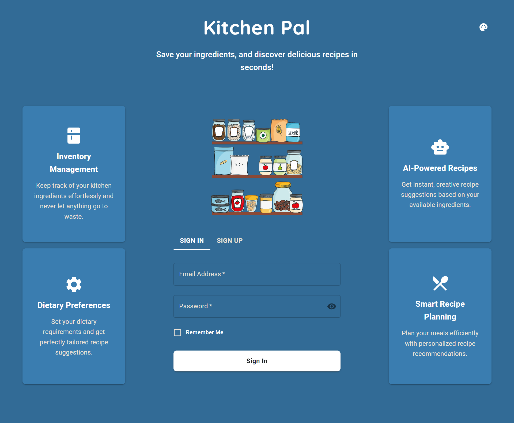

# KitchenPal 🍳

Welcome to **KitchenPal**, your smart recipe manager! This app is designed to help users generate, store, and manage their favorite recipes with ease. Powered by AI and built with a seamless, responsive interface, KitchenPal ensures that all your culinary needs are just a few clicks away.

## Features

- 🌟 **AI-Generated Recipes**: Recipes are generated using the Google Generative API, ensuring a wide variety of creative and delicious dishes.
- 📚 **My Recipes**: Save and view your favorite recipes with a user-friendly layout.
- 📝 **Recipe Details**: Easily expand each recipe to view the full details or delete ones you no longer need.
- 🌈 **Theme Customization**: Switch between different color themes to personalize your experience.
- 🔒 **User Authentication**: Manage your personal recipe collection with secure login via Appwrite.

## How It Works

1. **Authentication**: Users need to sign up or log in using their account via Appwrite.
2. **Recipe Generation**: Use the integrated AI to generate creative recipes, which are then saved to your personal account.
3. **Save & View Recipes**: Easily access your saved recipes, delete old ones, or expand to view the details.
4. **Theme Customization**: Switch between different color themes to suit your taste and preference.

## Tools & Libraries

- **Next.js**: For server-side rendering and frontend development.
- **React**: For building reusable components and managing state.
- **Material UI**: For sleek, accessible UI components.
- **Appwrite**: For secure user authentication and managing database interactions.
- **Google Generative API**: For generating unique and interesting recipes.

## License

This project is licensed under the Creative Commons License. Feel free to modify and share it as long as you give appropriate credit.

---

Enjoy cooking with KitchenPal! 🍽️
